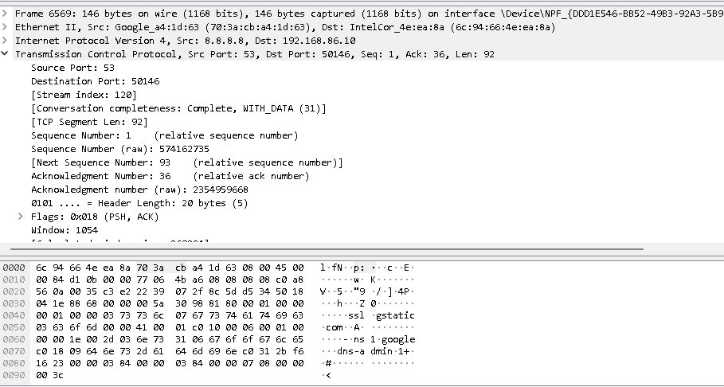

# Wireshark Display Filtering Project

This project demonstrates the use of Wireshark display filters to isolate and analyze specific network traffic.

## Steps

1.  Opened a sample PCAP file in Wireshark.
2.  Used basic protocol filters (TCP, UDP, HTTP, DNS).
3.  Filtered by IP address and port.
4.  Combined filters using logical operators.
5.  Used string filters to search for specific content.
6.  Filtered by packet length.

## Examples

* `tcp`: Show only TCP packets.
* `ip.addr == 192.168.80.1`: Show packets to/from 192.168.80.1.
* `http.request.method == "GET"`: Show HTTP GET requests.
* `dns.qry.name contains "example.com"`: Show DNS queries containing "google.com".

## Analysis Points

* Demonstrated the ability to filter network traffic using Wireshark.
* Gained experience with different filter types and logical operators.
* Improved understanding of network protocols.
